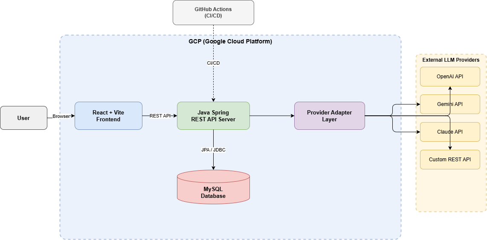
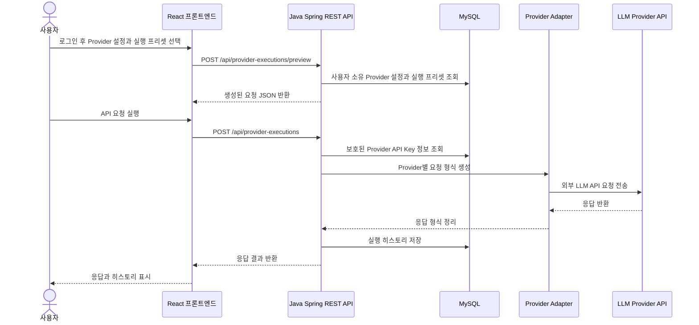

# PromptDeck 프로젝트 제안서

> 제출일: 2026-05-01 (금)
> 상태: 팀 회의 후 확정안
> 프로젝트명: PromptDeck

## 1. 프로젝트 개요

PromptDeck은 여러 LLM Provider의 프롬프트와 API 요청 형식을 한곳에서 관리하고 실행할 수 있는 서버 배포형 LLM API 요청 빌더 웹 서비스이다.

사용자는 로그인 후 OpenAI, Gemini, Claude, Custom API 등 Provider별 요청 형식을 설정하고, 자주 사용하는 실행 입력값과 옵션을 프리셋으로 저장할 수 있다. 이후 Provider 설정과 실행 프리셋을 선택해 요청 JSON을 미리 확인하고, 실제 API 요청을 실행한 뒤 응답 결과와 실행 기록을 다시 조회할 수 있다.

PromptDeck은 GCP에 배포되는 웹 서비스로 구성하며, 사용자별 Provider 설정, 실행 프리셋, API Key 기록, 실행 히스토리를 분리해 관리한다.

## 2. 시스템 아키텍처 다이어그램 (System Architecture Diagram)

### 요청 실행 흐름

### 구성 요소 역할

| 구성 요소 | 역할 |
| --- | --- |
| React + Vite Frontend | 로그인 화면, Provider 설정 화면, 실행 프리셋 화면, 요청 빌더, 요청 실행 화면, 히스토리 화면 구현 |
| Java Spring REST API Server | REST API 제공, 요청 검증, 사용자별 데이터 접근, Provider Adapter 호출, 요청 실행 처리 |
| MySQL Database | 사용자, refresh token, 조직, Provider 설정, 실행 프리셋, Provider API Key 기록, 실행 히스토리 저장 |
| Provider Adapter Layer | PromptDeck의 공통 요청 모델을 각 Provider의 JSON 요청 형식으로 변환 |
| GCP | 서비스가 실행되는 서버 배포 환경 |
| Docker / Docker Compose | 개발 및 배포 준비 환경을 재현 가능하게 구성 |
| GitHub Actions | 테스트, 빌드 검증, 배포 준비 자동화 |

## 3. 사용할 프레임워크 및 기술 (Frameworks to be Used)

| 영역 | 선택 기술 | 사용 이유 |
| --- | --- | --- |
| Frontend | React + Vite | 요청 JSON 미리보기, 프롬프트 입력 폼, 요청 실행 결과 표시처럼 동적인 UI를 구현하기에 적합하다. |
| Backend | Java Spring | 서버 배포형 웹 서비스에 필요한 구조적인 REST API 서버를 만들기 좋고, MySQL 기반 서비스와 연동하기 적합하다. |
| Database | MySQL | 사용자 계정, refresh token, 조직, Provider 설정, 실행 프리셋, 실행 기록처럼 지속적으로 보관해야 하는 관계형 데이터를 관리하기 적합하다. |
| DB Access | JPA / JDBC | Java Spring 백엔드에서 MySQL 데이터를 구조적으로 조회하고 저장하기 위해 사용한다. |
| API Client | Spring HTTP client library | 백엔드의 Provider Adapter Layer에서 외부 LLM Provider API를 호출하기 위해 사용한다. |
| Deployment | GCP | 팀 프로젝트의 서버 배포 환경으로 사용한다. |
| Containerization | Docker, Docker Compose | 프론트엔드, 백엔드, 데이터베이스 관련 실행 환경을 재현 가능하게 구성한다. |
| CI/CD | GitHub Actions | Pull Request와 주요 브랜치 변경 시 테스트와 빌드 검증을 자동화한다. |
| Collaboration | GitHub Issues, Pull Requests, Projects | 작업 단위 관리, 코드 리뷰, 진행 상황 추적, 팀원 기여 기록을 남기기 위해 사용한다. |

## 4. 요구사항 (Requirements)

### 기능 요구사항

| ID | 요구사항 | 설명 | 우선순위 |
| --- | --- | --- | --- |
| FR-01 | 사용자 로그인 | 사용자는 회원가입 또는 로그인 후 자신의 PromptDeck 데이터에 접근할 수 있다. | Must |
| FR-02 | Provider 관리 | 사용자는 LLM Provider 설정을 생성, 조회, 수정, 삭제할 수 있다. | Must |
| FR-03 | 실행 프리셋 관리 | 사용자는 자주 사용하는 실행 입력값과 옵션 프리셋을 생성, 조회, 수정, 삭제할 수 있다. | Must |
| FR-04 | Provider API Key 관리 | 사용자는 Provider API Key 저장 상태를 확인하고, 저장, 수정, 삭제할 수 있다. | Must |
| FR-05 | 요청 JSON 미리보기 | 사용자는 실제 실행 전에 생성된 최종 요청 JSON을 확인할 수 있다. | Must |
| FR-06 | 요청 실행 | 사용자는 생성된 요청을 최소 1개 이상의 Provider 또는 Custom API로 전송할 수 있다. | Must |
| FR-07 | 응답 표시 | 사용자는 Provider가 반환한 응답 또는 오류를 화면에서 확인할 수 있다. | Must |
| FR-08 | 요청 히스토리 | 사용자는 이전 요청, 응답, 상태 코드, 오류 정보를 조회할 수 있다. | Must |
| FR-09 | Provider Adapter 구조 | 백엔드는 Provider별 요청 변환 로직을 분리해 관리한다. | Must |
| FR-10 | 서버 배포 | 애플리케이션은 GCP 서버 환경에서 실행될 수 있어야 한다. | Must |
| FR-11 | Custom API 지원 | 사용자는 임의의 REST API 요청 형식을 설정할 수 있다. | Should |
| FR-12 | 기본 대시보드 | 사용자는 최근 실행 내역과 주요 요약 정보를 간단히 확인할 수 있다. | Could |

### 비기능 요구사항

| ID | 요구사항 | 설명 |
| --- | --- | --- |
| NFR-01 | 사용자별 데이터 분리 | Provider 설정, 실행 프리셋, API Key 기록, 실행 히스토리는 사용자별로 분리되어야 한다. |
| NFR-02 | API Key 보안 | Provider API Key는 평문 저장을 피하고, API 응답과 화면에는 마스킹된 정보만 표시한다. |
| NFR-03 | 유지보수성 | 프론트엔드, 백엔드, 데이터베이스, Provider Adapter 책임을 분리한다. |
| NFR-04 | 확장성 | 새로운 Provider를 추가할 때 Adapter를 추가하는 방식으로 확장할 수 있어야 한다. |
| NFR-05 | 실행 환경 재현성 | Docker Compose를 통해 개발 및 실행 환경을 재현할 수 있어야 한다. |
| NFR-06 | 협업 추적성 | Issues, Pull Requests, commits, Projects를 통해 팀 작업 과정을 추적할 수 있어야 한다. |
| NFR-07 | 테스트 가능성 | 핵심 API 동작은 자동 테스트 또는 수동 테스트로 검증할 수 있어야 한다. |
| NFR-08 | 배포 가능성 | 서비스는 GCP에 배포 가능해야 하며, CI/CD 흐름과 연결될 수 있어야 한다. |

## 5. 프로젝트 계획 및 역할 분담 (Project Plan Including Task Assignments)

팀은 총 3명으로 구성되며, 각 팀원은 하나의 주요 구현 영역을 담당한다. 문서 작성, 테스트, GitHub Issues, Pull Requests, Project board 관리는 각 담당 작업과 연결해 함께 진행한다.

| 담당 영역 | 주요 책임 | 예상 산출물 |
| --- | --- | --- |
| Backend 담당 | Java Spring REST API 서버 구현, 로그인 기능 연동, 사용자별 데이터 접근 처리, Provider/Execution Preset/History API, Provider Adapter Layer, LLM 요청 실행 로직 구현 | Spring API 서버, 백엔드 서비스 로직, Provider 요청 실행 흐름 |
| Frontend 담당 | React + Vite UI 구현, 로그인 화면, Provider 설정 화면, 실행 프리셋 화면, 요청 JSON 빌더, 요청 실행 화면, 히스토리 화면, API 연동 | 프론트엔드 화면, UI 상태 관리, API와 연결된 사용자 흐름 |
| Database & Docker 담당 | MySQL 스키마 설계, 테이블 관계 구성, 데이터 저장 정책 정리, Docker/Docker Compose 구성, GCP 배포 환경 지원 | MySQL 스키마, 컨테이너 실행 환경, 배포 환경 가이드 |

각 GitHub Issue에는 위 담당 영역을 기준으로 명확한 담당자를 지정한다. API 필드, DB 컬럼, 화면 흐름처럼 여러 영역에 영향을 주는 결정은 Issue와 Pull Request에서 함께 논의한다.

### 일정 계획

| 단계 | 기간 | 주요 목표 | 주 담당 |
| --- | --- | --- | --- |
| 제안서 제출 | ~ 2026-05-01 | 아키텍처 다이어그램, 사용 기술, 요구사항, 역할 분담을 포함한 제안서 제출 | 전체 |
| 1단계 | Week 1 | 프로젝트 구조 생성, Issues/Projects 구성, 협업 규칙 정리 | 전체 |
| 2단계 | Week 2 | Java Spring API 기본 구조와 MySQL 스키마 구현 | Backend, Database & Docker |
| 3단계 | Week 3 | React 로그인, Provider 설정, 실행 프리셋, 요청 빌더 화면 구현 | Frontend |
| 4단계 | Week 4 | 요청 미리보기, 요청 실행 흐름, Provider Adapter, 히스토리 UI 구현 | Backend, Frontend |
| 5단계 | Week 5 | Docker, GCP 배포 설정, CI/CD, 데이터 저장 환경 구성 | Database & Docker |
| 6단계 | Final Week | 테스트, 문서 정리, 시연 및 발표 준비 | 전체 |
