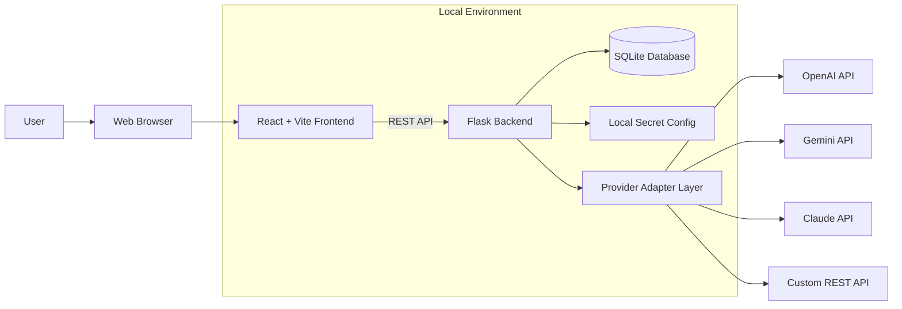
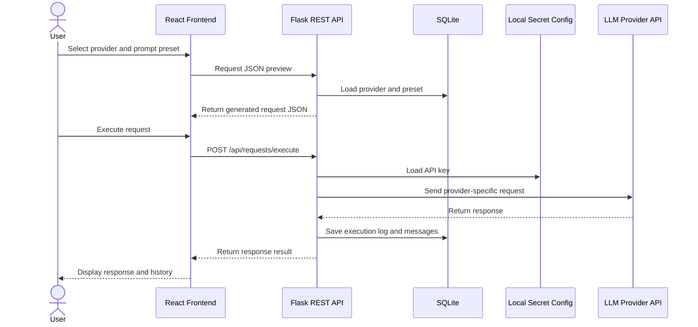

# PromptDeck Project Proposal

> Submission due: 2026-05-01 (Fri)
> Status: Draft for team discussion
> Project name: PromptDeck

## 1. Project Overview

PromptDeck is a local-first LLM API request builder.

The application helps users configure provider-specific API request formats, save reusable prompt presets, preview generated JSON requests, execute requests against selected LLM providers, and review request/response history. PromptDeck is designed as a local tool rather than a centralized SaaS service, so user API keys remain in the user's local execution environment.

## 2. System Architecture Diagram

### 2.1 High-Level Architecture



### 2.2 Request Execution Flow



### 2.3 Component Responsibilities

| Component | Responsibility |
| --- | --- |
| React Frontend | Provider settings UI, prompt preset UI, request builder, chat/test runner, history view |
| Flask Backend | REST API, validation, provider adapter dispatch, request execution, local config handling |
| SQLite Database | Provider settings, prompt presets, chat sessions, messages, execution logs |
| Local Secret Config | Provider API keys stored locally and excluded from Git |
| Provider Adapter Layer | Converts PromptDeck's common request model into each provider's JSON format |
| Docker Compose | Reproducible local execution environment |
| GitHub Actions | Automated test/build validation for pull requests |

## 3. Frameworks To Be Used

| Area | Selected Technology | Reason |
| --- | --- | --- |
| Frontend | React + Vite | Suitable for dynamic UI such as JSON preview, prompt forms, and chat-style interaction. Vite keeps setup and builds lightweight. |
| Backend | Flask | Lightweight Python web framework suitable for REST API MVP development within the project period. |
| Database | SQLite | File-based database that fits the local-first application concept and satisfies database integration requirements. |
| ORM / DB Layer | SQLAlchemy | Common Python ORM for structured database access and cleaner model management. |
| API Client | `requests` or `httpx` | Used by the backend to call external LLM provider APIs. |
| Containerization | Docker, Docker Compose | Provides reproducible local execution for frontend/backend and persistent local data volumes. |
| CI/CD | GitHub Actions | Runs automated tests/build checks on pull requests and main branch updates. |
| Version Control & Collaboration | GitHub Issues, Pull Requests, Projects | Supports issue tracking, code review, progress management, and contribution history. |

## 4. Requirements

### 4.1 Functional Requirements

| ID | Requirement | Description | Priority |
| --- | --- | --- | --- |
| FR-01 | Provider Management | Users can create, read, update, and delete LLM provider settings. | Must |
| FR-02 | Prompt Preset Management | Users can create, read, update, and delete reusable prompt presets. | Must |
| FR-03 | Local API Key Management | Users can save, update, and delete provider API keys in local configuration. | Must |
| FR-04 | Request JSON Preview | Users can preview the final JSON request before execution. | Must |
| FR-05 | Request Execution | Users can send generated requests to at least one provider or Custom API. | Must |
| FR-06 | Response Display | Users can view the response or error returned by the provider. | Must |
| FR-07 | Request History | Users can view previous requests, responses, status codes, and errors. | Must |
| FR-08 | Provider Adapter Structure | The backend separates provider-specific request conversion logic. | Must |
| FR-09 | Custom API Support | Users can configure a custom REST API request format. | Should |
| FR-10 | Basic Dashboard | Users can view a simple summary of recent activity. | Could |

### 4.2 Non-Functional Requirements

| ID | Requirement | Description |
| --- | --- | --- |
| NFR-01 | Local-first execution | The application runs on the user's local machine or local Docker environment. |
| NFR-02 | API key safety | API keys are not committed to Git and are not stored on an external server. |
| NFR-03 | Maintainability | The codebase is separated into frontend, backend, database, and adapter responsibilities. |
| NFR-04 | Extensibility | New providers can be added by implementing additional adapters. |
| NFR-05 | Reproducibility | Docker Compose can reproduce the development/runtime environment. |
| NFR-06 | Collaboration traceability | Issues, PRs, commits, and Projects show team contribution and progress. |
| NFR-07 | Testability | Core API behavior can be verified through automated or manual tests. |

### 4.3 MVP Scope

The MVP includes:

- Provider settings CRUD
- Prompt preset CRUD
- Local API key configuration
- Request JSON preview
- Request execution for Custom API and at least one LLM-compatible provider
- Request/response history
- Docker Compose execution
- GitHub Actions test/build workflow
- README and project documentation

The MVP excludes:

- User registration and login
- Centralized cloud server operation
- Team preset sharing
- Real-time collaboration
- Advanced monitoring dashboard
- Provider cost calculation

## 5. REST API Draft

| Method | Endpoint | Purpose |
| --- | --- | --- |
| GET | `/api/providers` | List providers |
| POST | `/api/providers` | Create provider |
| GET | `/api/providers/{provider_id}` | Get provider detail |
| PUT | `/api/providers/{provider_id}` | Update provider |
| DELETE | `/api/providers/{provider_id}` | Delete provider |
| GET | `/api/presets` | List prompt presets |
| POST | `/api/presets` | Create prompt preset |
| GET | `/api/presets/{preset_id}` | Get prompt preset detail |
| PUT | `/api/presets/{preset_id}` | Update prompt preset |
| DELETE | `/api/presets/{preset_id}` | Delete prompt preset |
| GET | `/api/secrets/providers` | Check provider API key status |
| PUT | `/api/secrets/providers/{provider_type}` | Save or update local API key |
| DELETE | `/api/secrets/providers/{provider_type}` | Delete local API key |
| POST | `/api/requests/preview` | Generate request JSON preview |
| POST | `/api/requests/execute` | Execute generated API request |
| GET | `/api/history` | List execution history |
| GET | `/api/history/{history_id}` | View execution detail |
| DELETE | `/api/history/{history_id}` | Delete execution history |

## 6. Database Draft

| Table | Purpose | Main Fields |
| --- | --- | --- |
| `providers` | Stores provider settings | `id`, `name`, `type`, `base_url`, `default_model`, `headers_template`, `body_template`, `response_path`, `enabled` |
| `prompt_presets` | Stores reusable prompts | `id`, `title`, `description`, `category`, `system_prompt`, `user_prompt_template`, `variables`, `tags` |
| `chat_sessions` | Groups related request/response messages | `id`, `title`, `provider_id`, `preset_id`, `created_at`, `updated_at` |
| `messages` | Stores chat-style messages | `id`, `session_id`, `role`, `content`, `metadata`, `created_at` |
| `execution_logs` | Stores API execution records | `id`, `session_id`, `provider_id`, `preset_id`, `request_body`, `response_body`, `status`, `status_code`, `error_message`, `latency_ms` |

API keys are not stored in the database. They are stored in a local file such as:

```text
config/secrets.local.json
```

Only an example file should be tracked by Git:

```text
config/secrets.example.json
```

## 7. Project Plan Including Task Assignments

### 7.1 Suggested Team Roles

Actual names should be filled in after team discussion.

| Role | Suggested Owner | Responsibilities |
| --- | --- | --- |
| Project Lead / Documentation | Member A | Proposal, README, final report, meeting notes, issue organization |
| Backend Developer | Member B | Flask REST API, provider adapter layer, request execution |
| Frontend Developer | Member C | React UI, request builder, preset screens, history screens |
| Database / Test | Member D | SQLite models, data persistence, API tests |
| DevOps | Member E | Docker Compose, GitHub Actions, execution guide |

If the team has fewer members, one person may cover multiple roles. The important rule is that each GitHub Issue should have a clear assignee.

### 7.2 Task Breakdown

| Area | Task | Output |
| --- | --- | --- |
| Planning | Finalize proposal and project scope | Proposal document, README, docs |
| Collaboration | Create Issues and GitHub Projects board | Issue list, project board |
| Backend | Set up Flask project structure | Backend app skeleton |
| Backend | Implement Provider CRUD API | Provider API and tests |
| Backend | Implement Prompt Preset CRUD API | Preset API and tests |
| Backend | Implement local secret config handling | Secret API, ignored local config |
| Backend | Implement request preview and execution | Preview/execute API |
| Backend | Implement provider adapter interface | Adapter modules |
| Database | Define SQLite models | Database schema |
| Database | Store request history | Execution log persistence |
| Frontend | Set up React + Vite project | Frontend app skeleton |
| Frontend | Implement layout and navigation | App shell |
| Frontend | Implement Provider Settings screen | Provider UI |
| Frontend | Implement Prompt Presets screen | Preset UI |
| Frontend | Implement Request Builder screen | JSON preview UI |
| Frontend | Implement Chat/Test Runner screen | Request execution UI |
| Frontend | Implement History screen | History UI |
| DevOps | Add Dockerfiles and Docker Compose | Local container execution |
| DevOps | Add GitHub Actions workflow | CI test/build results |
| Documentation | Write execution guide and API notes | Updated README/docs |

### 7.3 Schedule Draft

The exact schedule should be adjusted to the course timeline.

| Phase | Period | Main Goal | Deliverables |
| --- | --- | --- | --- |
| Proposal | ~ 2026-05-01 | Submit project proposal | Architecture diagram, frameworks, requirements, task plan |
| Phase 1 | Week 1 | Initialize project and collaboration board | Repo structure, Issues, Projects |
| Phase 2 | Week 2 | Implement backend and database basics | Flask API, SQLite models |
| Phase 3 | Week 3 | Implement frontend core screens | Provider/Preset/Builder UI |
| Phase 4 | Week 4 | Implement request execution and history | Adapter, execute API, history UI |
| Phase 5 | Week 5 | Add Docker and CI/CD | Docker Compose, GitHub Actions |
| Phase 6 | Final Week | Test, polish, document, prepare presentation | Final README, report, demo |

### 7.4 Definition of Done

An MVP task is considered complete when:

- The related Issue is linked to a Pull Request.
- The implementation satisfies the Issue requirements.
- Basic test or manual verification is documented.
- The PR is reviewed and merged.
- Related documentation is updated if needed.
- The GitHub Project item is moved to `Done`.

## 8. Collaboration Plan

PromptDeck will use GitHub collaboration tools as follows.

| Tool | Usage |
| --- | --- |
| GitHub Issues | Track features, bugs, documentation tasks, DevOps tasks |
| GitHub Pull Requests | Review and merge each feature or document change |
| GitHub Projects | Manage progress with Backlog, Todo, In Progress, Review, Done |
| Branches | Use feature branches such as `feature/provider-crud` and `docs/project-proposal` |
| Commits | Use concise conventional-style messages such as `feat: add provider API` |

## 9. Risks and Mitigation

| Risk | Impact | Mitigation |
| --- | --- | --- |
| Provider API differences | Request execution may take longer than expected | Implement a common adapter interface and prioritize Custom/OpenAI-compatible execution |
| API key exposure | Security and privacy issue | Store keys locally, ignore secret files, return masked key status only |
| Scope creep | MVP may not be completed | Separate Must/Should/Could features and finish Must items first |
| Frontend/backend integration delay | Demo instability | Agree on API draft early and use mock data where needed |
| Docker/CI setup delay | Technical requirement risk | Add minimal Docker Compose and GitHub Actions early |

## 10. Proposal Submission Checklist

- [ ] System architecture diagram is included.
- [ ] Frameworks to be used are listed with reasons.
- [ ] Functional and non-functional requirements are listed.
- [ ] MVP scope and excluded features are clear.
- [ ] Project plan includes task assignments.
- [ ] Collaboration plan mentions Issues, PRs, and Projects.
- [ ] Docker and CI/CD plan is included.
- [ ] Risks and mitigation strategies are included.
- [ ] Team member names replace placeholder owners.
